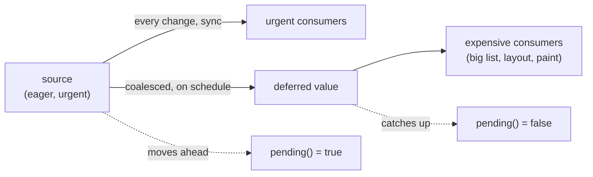

# @zakkster/lite-defer

[](https://www.npmjs.com/package/@zakkster/lite-defer)

[](https://github.com/sponsors/PeshoVurtoleta)
[](https://bundlephobia.com/result?p=@zakkster/lite-defer)
[](https://www.npmjs.com/package/@zakkster/lite-defer)
[](https://www.npmjs.com/package/@zakkster/lite-defer)
[](https://github.com/PeshoVurtoleta/lite-signal)


[](https://opensource.org/licenses/MIT)

**Deferred reactive values for [`@zakkster/lite-signal`](https://www.npmjs.com/package/@zakkster/lite-signal).**

`defer(source)` returns a value that **lags** its source and catches up on a
scheduler, **coalescing** a synchronous burst into a single downstream update. It
draws a *concurrency frontier* across the reactive graph: urgent consumers read the
source and see every change immediately; expensive consumers read the deferred
value and update on the scheduler's cadence -- a frame, an idle slot, a microtask --
instead of on every `set`.

This is `useDeferredValue` / Solid's `createDeferred` for lite-signal, plus a
`pending()` signal that tells you, reactively, when the deferred value is behind.

```
npm install @zakkster/lite-defer
```

> **Peer dependency:** `@zakkster/lite-signal` `^1.5.0` (uses `createRoot`). ESM
> only. DOM-free core. MIT.

---

## The frontier



The source is computed **eagerly**. What the frontier defers is the **work
downstream of the deferred value** -- the re-render, the re-layout, the expensive
recompute that reads it. Place the frontier where you want that work throttled.

---

## `defer(source, opts?)`

```js
import { defer } from "@zakkster/lite-defer";
import { signal, computed, effect } from "@zakkster/lite-signal";

const query = signal("");
const deferredQuery = defer(query);              // lags `query`, catches up next microtask

// Expensive: filters 10k rows. Runs on the deferred cadence, not on every keystroke.
const results = computed(() => filterRows(deferredQuery()));

effect(() => { input.value = query(); });        // urgent: the field stays responsive
effect(() => { render(results()); });            // heavy: updates after the burst settles
effect(() => { spinner.hidden = !deferredQuery.pending(); });   // stale indicator
```

`deferredQuery()` seeds **synchronously** to `query`'s current value, then lags: a
burst of keystrokes coalesces into one catch-up to the final value.

**To defer an expensive *derivation*, defer its cheap input** (as above): `search`
runs on the deferred value's cadence because it reads `deferredQuery()`, not
`query()`.

### `pending()`

`deferredQuery.pending()` is a reactive boolean: **true** the instant the source
moves ahead, **false** again when the deferred value catches up. The hook for
dimming stale content or showing a spinner while the heavy update is in flight --
the value lags, but the "I'm stale" signal is immediate.

### Options

| Option | Default | Meaning |
| --- | --- | --- |
| `schedule` | `microtask` | how to coalesce the catch-up: `(flush) => void` |
| `equals` | `Object.is` | equality for the deferred value; gates the catch-up |

---

## Schedulers

A scheduler is `(flush: () => void) => void`: it receives a flush thunk and calls it
when the deferred value should catch up. Coalescing is built in -- `defer` schedules
at most one flush per burst.

```js
import { defer, raf, idle, timeout } from "@zakkster/lite-defer";

defer(src);                          // microtask (default) -- end of current task
defer(src, { schedule: raf });       // frame cadence -- at most once per animation frame
defer(src, { schedule: idle });      // lowest priority -- an idle slot
defer(src, { schedule: timeout(150) }); // debounce cadence -- 150ms after the last change
```

`raf` and `idle` fall back to a timeout where the host lacks
`requestAnimationFrame` / `requestIdleCallback` (Node, SSR). Any `(flush) => void`
works -- including lite-raf's frame scheduler if you already ship it.

---

## `deferEffect(fn, opts?)`

An effect whose runs are coalesced onto a scheduler -- it runs **at most once per
burst** on the scheduler's cadence. A render effect at frame cadence collapses all
of a frame's state changes into one run:

```js
import { deferEffect, raf } from "@zakkster/lite-defer";

const stop = deferEffect(() => { paint(world()); }, { schedule: raf });   // paint <= once/frame
```

The initial run is also scheduled (the engine's scheduled-effect semantics). This
is a thin, named wrapper over lite-signal's `effect(fn, { scheduler })`.

---

## Ownership

`defer`'s internals are **detached** (`createRoot`), so an enclosing scope
re-running never tears the deferred value down. The caller owns teardown:

```js
deferredQuery.dispose();   // stop tracking, dispose the deferred + staleness signals
```

Call `defer` once at setup. There is no auto-cleanup.

---

## Zero-GC

The deferred signal, the staleness signal, the tracking effect, and the flush thunk
are all fixed per `defer`. A churn of source-`set` + catch-up allocates nothing on
the engine pool (**20,000 cycles flat**, verified): the tracking effect re-tracks on
a stable read order (cursor reuse), and both signal sets are allocation-free.

**Honest non-claim:** the scheduler's own queue entry -- a microtask, a `rAF`
callback, a timer -- is the host's, not the engine pool's. And `defer` does not
defer the *source's* computation (model A): reading the source inside the tracking
effect forces it synchronously. Defer a cheap input upstream to defer the work.

---

## API

```ts
defer<T>(source: () => T, opts?: { schedule?: Scheduler; equals?: (a: T, b: T) => boolean }): Deferred<T>
deferEffect(fn: () => void, opts?: { schedule?: Scheduler }): () => void
createDeferrer(registry): { defer, deferEffect }      // bind to a non-default registry

microtask: Scheduler   raf: Scheduler   idle: Scheduler   timeout(ms): Scheduler
type Scheduler = (flush: () => void) => void
type Deferred<T> = (() => T) & { pending(): boolean; dispose(): void }
```

---

## License

MIT (c) 2026 Zahary Shinikchiev &lt;shinikchiev@yahoo.com&gt;
